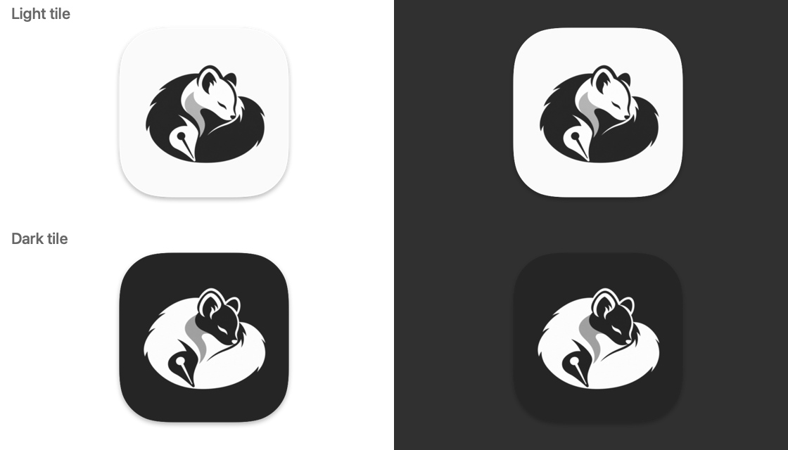
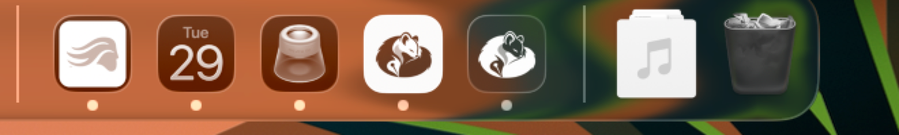
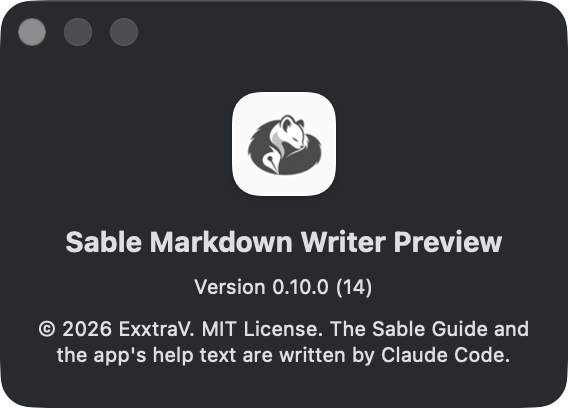
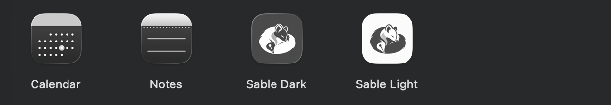
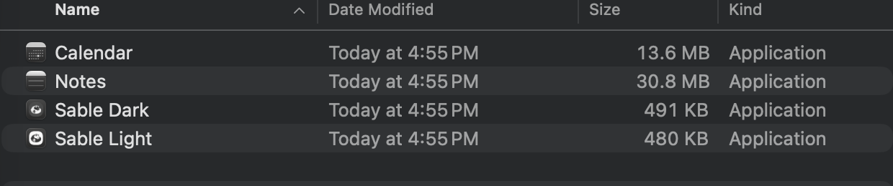
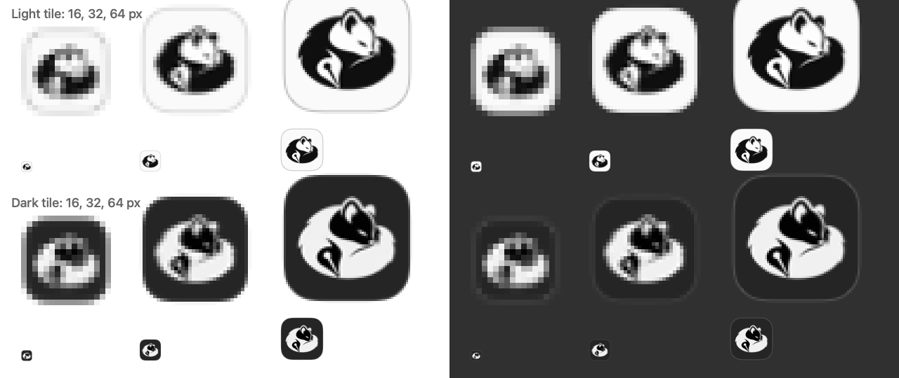

# Prose request: app icon

> How this works: each "##" heading is one thing Claude needs from you.
> Write your answer under "Your text" and leave the heading alone. This one
> is a choice, not prose, so there are no over-the-top drafts and no
> PROSE-TODO markers in the real files: the app builds with the light tile
> today, so nothing blocks a merge. Answer whenever you like; Claude applies
> your choice and deletes this file and the `app-icon/` folder of pictures.
>
> All the pictures below come from the real icon files, built by the real
> build script (`scripts/build-icon.sh`), and the Dock and Finder ones are
> screenshots of throwaway apps that used each icon, on this Mac.

## App icon · Light or dark tile
- Where: `Assets/Sable.icns`, which shows in the Dock, Finder, Spotlight, and the About panel
- Length: one word, "light" or "dark"
- Must get across: which tile you want the app to wear
- Verified facts: below

**What's the same in both.** Same sleeping-curl artwork, same size on the Dock as the apps around it (the kit's tile filled 92% of the square and would have looked bigger than its neighbors, so it now fills the standard 80%). Same corner shape as Apple's own icons, matched against the Notes icon. Same simplified black-and-white curl at 16, 32, and 64 pixels.

**Side by side, large** (light on the top row, dark below; white background left, dark right):

**In your Dock** (light first, then dark, between the apps that were already there). Your Dock uses macOS's tinted icon style, which recolors every icon; you'll see the true colors in the normal app. What you can judge here is size and weight:

**About panel** (the light tile, from the actual app; it takes its icon straight from `Sable.icns`, so there was nothing else to change):

**In Finder, large icons** (dark tile first, then light, beside Calendar and Notes; Finder recolors with the same icon style as your Dock):

**In Finder, list view** (16-pixel icons):

**At 16, 32, and 64 pixels** (true size on the bottom of each cell, enlarged above it, on white and on dark):

**What I saw.**
- **Light tile.** Keeps its outline on both light and dark backgrounds (the standard soft shadow, plus a hairline at small sizes). It's the brightest icon in a row, so it's easy to find. The kit recommends it, because the dark icon it replaces was being mistaken for Firefox's in a gray Dock.
- **Dark tile.** Closest to the old logo, and calmer next to bright icons. On a dark Dock or a dark Finder window its edge nearly disappears (see the right-hand panels above), so the icon reads as a floating white curl with no tile. That's fine to some eyes and a loss of shape to others.
- **My pick:** light. Its shape holds up on every background and at every size, and it's the one the kit recommends. It's your call.

If you choose dark, Claude moves `app-icon/tile-dark-1024.png` into `Assets/`, points `scripts/build-icon.sh` at it, removes the light master, and rebuilds. The renderer reverses the small-size mark for a dark tile by itself.

Your text:
>

## App icon · Things to know when you open the app
- Where: your Dock, after you open the new build
- Length: no answer needed unless one of these bites
- Must get across: nothing to write; this is a checklist for you
- Verified facts: below

1. **Two copies of Sable exist on your Mac, and the new build won't start while the installed one runs.** The one pinned in your Dock is the installed copy in `/Applications`, which still has the old logo. The new build is `build/Sable Markdown Writer.app` in this branch's worktree; it shares the installed copy's identity, so macOS quits it the moment it opens. Save your work, quit the installed Sable, then open the new build. I didn't close your copy. Meanwhile a **Sable Markdown Writer Preview** is running with the same icon (it has its own identity and settings), so you can see the new icon in your Dock now. The pinned Dock icon updates for good when this branch is merged and you install a release.
2. **If the old icon still shows.** macOS caches icons. Quit Sable, then run `killall Dock Finder`. If that isn't enough, restart the Mac; as a last resort, `sudo rm -rf /Library/Caches/com.apple.iconservices.store` followed by a restart clears the whole icon cache.
3. **Optional, not done: a macOS 26 "glass" icon.** Apple's Icon Composer makes layered icons that get the new glass look. It needs full Xcode, and this Mac has only the Command Line Tools. The icon as built already sits correctly in the Tahoe Dock (see the Dock picture). Say so if you'd like the layered version planned for later.

Your text:
>
